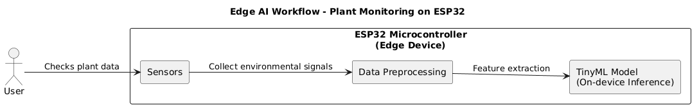
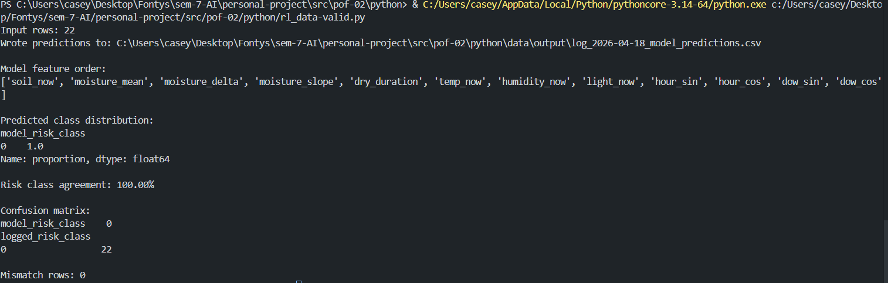

= PlantHealthMonitor : Final Project Report
:title-page: true
:author: Casey Stijlaart
:docdatetime: 2026-06-11
:doctype: report
:sectnums:
:toc:
:toclevels: 3
:pdf-page-size: A4
:pdf-page-layout: portrait

<<<

== Introduction

=== Project Context

This project was developed as part of the AI for Society minor at Fontys University of Applied Sciences, Eindhoven. The project addresses a common problem: many people struggle with consistent, informed plant care. Generic advice is often unhelpful, and most existing solutions either require expensive cloud infrastructure or provide no intelligent analysis at all.

PlantHealthMonitor (PHM) applies AI techniques in an embedded, privacy-respecting setting to bridge that gap, providing real-time insights and care recommendations directly on the device, without depending on external services for inference.

=== Project Goal

The primary goal was to gain practical experience with integrating AI into a real-world embedded system by designing and implementing a smart desk plant monitoring system that provides real-time insights and actionable care recommendations for indoor plants.

The project was also an opportunity to engage with the full development cycle: background research, prototyping, iterative redesign, system design, implementation, and critical reflection on societal impact.

<<<

=== Research Questions

The central research question guiding the project was:

____
How can a smart desk plant monitoring system use AI to provide accurate, user-friendly care recommendations while addressing ethical, legal, and societal considerations?
____

This was broken down into three categories of sub-questions:

*Technical / AI*

* Which AI model types are suitable for classifying plant health on an embedded microcontroller?
* Do existing trained models exist, or does a custom dataset need to be built?
* Which sensors are appropriate for monitoring indoor plant conditions?
* How can a lightweight ML model be deployed and validated on an ESP32?

*User Interaction*

* How should care recommendations be presented to be actionable and non-alarming?
* What usability features make the system accessible to non-technical users?

*Ethical and Legal*

* What are the privacy implications of collecting continuous sensor data?
* What are the ethical responsibilities around automating plant care decisions?

<<<

== Background Research

=== Related Work

A review of existing plant monitoring systems identified three categories:

[cols="2,2,2,2", options="header"]
|===
| Category | Cost | Target Use | AI Capability

| IoT-Based (non-AI)
| Low
| Hobbyist / personal
| Threshold automation only

| AI/ML-Based
| Low–medium
| Research / experimental
| Advanced classification, limited deployment

| Commercial Solutions
| High
| Large-scale agriculture
| Advanced sensors, proprietary models
|===

The comparison identified a clear gap: there are no affordable, small-scale AI/ML-based plant monitoring systems designed specifically for personal indoor plant care. Existing research-grade systems are not deployable on consumer hardware, and commercial systems target agriculture rather than individual users. PHM was designed to fill this gap.

=== Technical Background

==== Edge AI and TinyML

Edge AI refers to running machine learning inference directly on embedded hardware rather than in the cloud. For plant monitoring this offers three key advantages: resilience (no internet dependency), privacy (sensor data stays on device), and latency (instant response without a network round-trip).

The ESP32 microcontroller, while constrained in memory and compute, is capable of executing lightweight ML workloads. Two established frameworks enable this: TensorFlow Lite Micro (TFLM) and Edge Impulse. Both support quantized models that fit within the ESP32's available SRAM and flash.

.Edge AI Workflow — Plant Monitoring on ESP32

<<<

==== Model Selection

Research into models suitable for embedded systems identified the following candidates:

* **Decision trees** — fast, interpretable, low memory.
* **Linear regression** — simple, efficient, suitable for regression tasks.
* **Small neural networks (MLP)** — more expressive, trainable with standard tools, exportable to TFLM.
* **Threshold-based anomaly detection** — deterministic, zero inference cost.

For PHM, a small MLP was selected for both the health risk classifier and the predictive irrigation regression model, due to its ability to learn non-linear relationships between sensor features while remaining small enough for on-device deployment.

==== Sensor Data and Preprocessing

The system monitors four environmental factors: soil moisture, temperature, humidity, and light intensity. On the ESP32, preprocessing steps include normalisation, noise filtering, and feature extraction from a sliding window of historical readings. This temporal context is essential for time-to-action predictions (e.g., "water in 4 hours") that could not be derived from a single instantaneous reading.

==== Datasets

No existing public dataset adequately matched the project's use case. Available Kaggle datasets for plant health were either image-based (not applicable to sensor data) or lacked the multivariate, time-series structure needed for the predictive model. This led to the decision to generate a custom synthetic dataset — a decision that became a significant learning point during prototyping (see <<_proof_of_concept_iterations>>).

<<<

== System Design

=== Requirements

Requirements were derived from the project goal and structured using MoSCoW prioritization.

==== User Requirements

[cols="2,15,3", options="header"]
|===
| ID | Requirement | Use Case(s)

| UR_001 | The user should be able to add a new plant by pairing a device and entering its care requirements. | UC01
| UR_002 | The user should be able to monitor the health status of a plant. | UC02, UC03
| UR_003 | The user should be able to view current and historical plant data. | UC03
| UR_004 | The user should be able to update plant care settings. | UC04
| UR_005 | The user should receive notifications and care recommendations when abnormal conditions occur. | UC05
| UR_006 | The user should be able to request an immediate measurement on demand. | UC06
| UR_007 | The user should be able to remove a device so it can be re-paired. | UC07
|===

==== Functional Requirements

[cols="2,15,3", options="header"]
|===
| ID | Requirement | Use Case(s)

| FR_001 | The user interface must allow the user to add a plant with its care preferences. | UC01
| FR_002 | The data storage must store devices, plant profiles, and care settings. | UC01, UC04
| FR_003 | The edge node must be configurable through BLE provisioning. | UC01
| FR_004 | The sensor array must provide environmental data: soil moisture, temperature, humidity, and light level. | UC02
| FR_005 | The edge node must use an on-device ML model to predict plant health. | UC02, UC05
| FR_006 | The edge node must store measurement results locally and send them to the data storage. | UC02
| FR_007 | The user interface must display current and historical plant data. | UC03
| FR_008 | The user interface must allow the user to update plant care settings, which the edge node applies. | UC04
| FR_009 | The edge node must detect abnormal conditions and generate care recommendations. | UC05
| FR_010 | The user interface must notify the user when abnormal conditions are detected. | UC05
| FR_011 | The edge node must respond to user commands issued through the data storage. | UC06, UC07
| FR_012 | The edge node must support a factory reset that erases all of its state. | UC07
|===

==== Non-Functional Requirements

[cols="2,18", options="header"]
|===
| ID | Requirement

| NFR_001 | The system should be modular so components can be updated or replaced independently.
| NFR_002 | The system should support multiple edge nodes and plants.
| NFR_003 | The edge node must operate within embedded hardware constraints such as limited memory and processing power (ML inference, BLE, and TLS combined on a single ESP32).
| NFR_004 | WiFi credentials and the cloud API key must not be stored in the firmware binary; they are transferred once over BLE during provisioning, and removing a device must erase them.
| NFR_005 | The edge node should operate autonomously after provisioning, without requiring the user interface to be active.
|===

<<<

=== Architecture

The system is organised into three layers:

[cols="1,2,3", options="header"]
|===
| Layer | Component | Responsibility

| Edge
| ESP32 + sensor array
| Sensor acquisition, preprocessing, ML inference, cloud sync every 3 hours.

| Cloud
| Supabase (PostgreSQL + Realtime)
| Persistent storage of readings and settings; realtime change events to connected clients.

| App
| Flutter (iOS / Windows)
| Live dashboard, charts, preferences editor, push notifications.
|===

The edge layer operates independently. If the network is unavailable, the ESP32 continues collecting and classifying data locally, buffering readings in a CSV history on its filesystem (LittleFS). When connectivity is restored, data is synced to the cloud.

Besides the scheduled 3-hour monitoring cycle, the device polls the cloud every 5 seconds for user commands: an on-demand measurement or a factory reset. This gives the app indirect control over the device without requiring a direct connection after the initial BLE pairing.

.System Architecture — Hardware and Data Flow
image::../system-design/images/hw-diagram.svg[Hardware architecture diagram, align="center"]

<<<

=== Use Cases

Seven use cases define the system's functional scope:

* *UC01 — Add Plant*: The user pairs a device over BLE, then adds a plant with a label and initial care preferences. These are saved to the cloud and picked up by the device.
* *UC02 — Monitor Plant*: The ESP32 continuously reads sensors, runs inference, and uploads results. The app reflects the latest status in real time via a Supabase Realtime subscription.
* *UC03 — View Plant Data*: The user opens the data view to see sensor history charts for the last week (up to 56 readings at 3-hour intervals).
* *UC04 — Update Settings*: The user edits care preferences in the app. A version counter prevents stale overwrites when settings are synced across devices.
* *UC05 — Abnormal Condition Alert*: When risk class changes to moderate (1) or high (2), the app generates a push notification. Duplicate notifications are suppressed.
* *UC06 — Request Measurement*: The user requests an immediate measurement; the device picks up the command flag within 5 seconds and runs a full monitoring cycle.
* *UC07 — Remove Device*: The user removes a device; it factory-resets (erasing history, credentials, and its cloud registration) and reboots into pairing mode.

.Use Case Diagram — Plant Health Monitoring System
image::../system-design/images/use-case-diagram.svg[Use case diagram, align="center"]

<<<

=== Component Overview

[cols="2,4", options="header"]
|===
| Component | Responsibility

| Edge Node (ESP32)
| Reads sensors, preprocesses data (normalisation, feature extraction, temporal windowing), runs ML inference via the pluggable `MLLayer`, builds recommendations via `RecommendationEngine`, and POSTs to Supabase.

| Sensor Array
| Capacitive soil moisture sensor (GPIO 34), DHT22 temperature + humidity sensor (GPIO 4), LDR light sensor (GPIO 35).

| MLLayer
| Pluggable abstraction supporting rule-based classification, TFLM MLP classifier, and Edge Impulse models.

| RecommendationEngine
| Combines raw sensor values, preference thresholds, and ML risk class to produce boolean action flags and calls `PredictiveIrrigationModel` for the time estimate.

| PredictiveIrrigationModel
| Regression MLP (trained offline, exported as C++ header weights) that predicts minutes until watering is needed.

| ProvisioningService
| BLE service advertised on first boot (`PHM-XXXXXX`); receives WiFi credentials and cloud configuration from the app and stores them in the LittleFS pairing document.

| CloudService
| HTTPS REST client for Supabase: device registration, readings and model metrics upload, profile fetching, and command flag polling.

| FileStorageService / CloudLogger
| Persist the pairing state and CSV sensor history on LittleFS; mirror device log output to the cloud for remote diagnostics.

| Cloud (Supabase)
| Five tables: `devices` (registrations, heartbeat, command flags), `plant_settings` (per-plant preferences with version control), `plant_readings` (sensor data, risk class, recommendations), `model_metrics`, and `logs`.

| Flutter App
| Device pairing (BLE), realtime dashboard, plant selector, sensor history charts, preferences editor, notification scheduler, device commands (measure now, remove device).
|===

.Component Diagram — System Components and Interactions
image::../system-design/images/component-diagram.svg[Component diagram, align="center"]

<<<

== Proof of Concept Iterations

The system was developed through three proof-of-concept iterations. Each uncovered problems that led to a redesign before the next iteration.

=== PoC-01: Initial ML Approach

The first prototype trained logistic regression, MLP, and random forest classifiers on a publicly available plant health dataset.

*Key findings:*

* The models achieved high accuracy, but analysis revealed they were replicating a single threshold on soil moisture. Temperature and humidity contributed almost nothing to predictions.
* The dataset did not represent real-world plant health dynamics — it lacked temporal information and meaningful multi-sensor interactions.
* The models could have been replaced by a single `if soil < 35%` rule with equivalent accuracy.

*Conclusion:* The dataset was unsuitable and the ML approach was not justified. A redesign was needed.

=== PoC-02: Dataset Redesign and Model Revision

PoC-02 focused entirely on building a dataset that would force the model to learn genuine multi-factor relationships.

*Changes made:*

* The synthetic data generation was redesigned to introduce time-dependent environmental variables, feature interactions (e.g., high temperature amplifying the impact of low humidity), and realistic stress scenarios.
* Pre-engineered features that encoded domain logic (effectively bypassing the model) were removed.
* Multiple model architectures were re-evaluated on the new dataset.

*Results:*

* Feature importance analysis confirmed that all four sensor inputs contributed meaningfully to predictions.
* The MLP generalised to unseen conditions rather than memorising a threshold.
* The revised dataset demonstrated that a well-designed training set is as important as model architecture when justifying ML over simpler alternatives.

*Conclusion:* The redesigned dataset and model were ready for embedded deployment.

=== PoC-03: Embedded Deployment and Validation

PoC-03 moved the validated model onto the ESP32 and added the full system stack.

*Changes and additions:*

* The TFLM model was deployed via the `MLLayer` abstraction, allowing the rule-based fallback to remain available for comparison.
* A CSV logger was added using LittleFS to persist a week of sensor history on the device.
* A lightweight HTTP server was added to the ESP32 for local inspection of live data and history.
* NTP time synchronisation was implemented to ensure accurate timestamps in the cloud.
* User personalisation was introduced: per-plant preference profiles stored in Supabase and read by the `RecommendationEngine`.

.PoC-03 — ESP32 Local Web Interface for Plant Settings and Log Files
image::../proof-of-concept/images/plant1-server.png[

*Validation:*

On-device TFLM inference was compared against the same model running in Python (scikit-learn / numpy). Predictions were identical across all test vectors, confirming that the C++ weight export and inference pipeline were correct.

*Conclusion:* The embedded system performed as expected. The validation confirmed model consistency between the training environment and the deployed device.

<<<

== Implementation

=== Firmware (ESP32)

The production firmware (`src/firmware/`, v1.1) is built with PlatformIO. The main monitoring loop runs every 3 hours:

. Sensor readings are acquired from the three sensor types.
. Readings are normalised against per-plant preference thresholds.
. A feature vector is constructed, including temporal features derived from the circular history buffer stored in CSV on LittleFS.
. The `MLLayer` runs the TFLM classifier and returns a risk class (0/1/2) with per-class confidence scores.
. The `PredictiveIrrigationModel` runs the regression MLP and returns a time estimate in minutes.
. The `RecommendationEngine` combines sensor values, preference thresholds, ML risk class, and the time estimate to produce a `Recommendation` struct (boolean action flags + summary string).
. The result is serialised to JSON and uploaded to Supabase via HTTPS.

Device configuration is handled entirely at runtime through BLE provisioning. On first boot (or after a factory reset) the device advertises a BLE service; the app transfers the WiFi credentials, cloud API key, and Supabase URL, after which the device registers itself in the cloud and stores its pairing state on LittleFS. No credentials are compiled into the firmware binary, and unpairing a device erases them by construction. Between monitoring cycles, a 5-second polling loop picks up user commands (on-demand measurement, factory reset) from the cloud.

The full API reference of the firmware is generated with Doxygen from the annotated source code and is included with the system design document.

<<<

=== Mobile Application (Flutter)

The Flutter app (`src/app/`) targets iOS and Windows, with an Android variant maintained alongside. Key implementation details:

* Device pairing is implemented over BLE: the app scans for unpaired devices (`PHM-XXXXXX`), transfers the WiFi and cloud configuration, and then polls the `devices` table until the device registers itself.
On iOS this provisioning flow (BLE device scanning and WiFi network scanning) is not available, because the required capabilities cannot be used when sideloading with a free Apple ID; devices must be paired from the Android build instead (see <<_ios_platform_restrictions>>).
* A Supabase Realtime subscription delivers `plant_readings` inserts to the app in real time without polling.
* The dashboard renders a status card per plant, updating reactively when new data arrives.
* Sensor tiles show the current reading and highlight whether it falls within the plant's preference band.
* The preferences editor reads and writes to the `plant_settings` table with an incrementing version field to handle concurrent edits.
* Push notifications are scheduled locally using `flutter_local_notifications` with timezone-aware scheduling for the daily summary feature.
* Notification deduplication prevents repeated alerts for the same persisting condition.
* Device management lets the user trigger an immediate measurement or remove a device by setting command flags on its `devices` row.

<<<
    
=== Technologies Used

[cols="2,3", options="header"]
|===
| Technology | Role

| ESP32 microcontroller | Edge processing, sensor acquisition, on-device ML inference.
| PlatformIO | Firmware build system and dependency management.
| TensorFlow Lite Micro (TFLM) | On-device neural network inference.
| LittleFS | Filesystem for the pairing state and CSV history on ESP32 flash.
| BLE (Bluetooth Low Energy) | Runtime device provisioning from the app; no credentials in the firmware binary.
| Supabase | Managed PostgreSQL + Realtime backend (cloud layer).
| Flutter | Cross-platform mobile and desktop application.
| fl_chart | Sensor history charts in the Flutter app.
| flutter_local_notifications | Push notifications and daily summary scheduling.
| Python / scikit-learn | Offline model training and validation.
| Doxygen | Generated API reference of the firmware source code.
|===

<<<

== Testing and Validation

=== Model Validation

The most critical validation step was confirming that on-device TFLM inference matched the offline Python model exactly. This was done by:

. Running both models against the same set of test feature vectors.
. Comparing the risk class output and confidence scores for each vector.
. Confirming identical results across all test cases.

This confirmed that the C++ weight export, feature normalisation, and inference pipeline introduced no numerical errors.

.Model Validation Output — 100% Risk Class Agreement Between TFLM and Python

<<<

=== Functional Testing

Each use case was tested manually against the running system:

[cols="1,3,1", options="header"]
|===
| Use Case | Test | Result

| UC01 | Add a plant in the app; verify it appears on the device's next sync. | Pass
| UC02 | Observe live sensor readings updating in the app within seconds of a device reading. | Pass
| UC03 | Navigate to the data view and verify charts populate with historical readings. | Pass
| UC04 | Change a preference in the app; verify the device picks it up on the next cycle. | Pass
| UC05 | Trigger an abnormal reading; verify a push notification is received. | Pass
| UC06 | Request a measurement in the app; verify the device runs a cycle within seconds. | Pass
| UC07 | Remove a device in the app; verify it factory-resets and re-enters BLE pairing mode. | Pass
|===

=== Embedded Performance

The TFLM model and full firmware stack were verified to fit within the ESP32's memory constraints. Inference time per cycle was negligible relative to the 3-hour interval between readings. Power consumption was not formally measured but the 3-hour sleep interval between active cycles makes the system suitable for low-power operation with minor modifications (light sleep mode).

<<<

== Results

The completed system meets all must-have requirements and the majority of should-have requirements defined at the start of the project.

* A fully functional embedded plant monitoring device was built and deployed.
* On-device ML inference (risk classification and predictive irrigation) runs correctly on the ESP32 without cloud dependency.
* A cross-platform Flutter application displays live sensor data, health status, recommendations, and historical charts.
* Push notifications alert users to plant care needs in real time.
* The system supports multiple plants simultaneously with per-plant preference profiles.
* Devices are paired at runtime over BLE and managed through the app for their full lifecycle (provisioning, on-demand measurements, removal with a clean factory reset) — no firmware recompilation is needed for setup.
* The full development cycle — from background research and dataset design through to embedded deployment and cross-platform app — was completed within the semester.

The iterative prototyping process was particularly valuable. The failures of PoC-01 and PoC-02 led directly to a better understanding of what makes ML justifiable over simpler rule-based approaches, and resulted in a more robust final implementation.

<<<

== Challenges Encountered

=== Dataset Design

The most significant technical challenge was designing a dataset that genuinely required ML rather than replicating a threshold rule. The first iteration wasted considerable time before feature importance analysis revealed the problem. The lesson — that a poorly designed dataset produces a dishonest model regardless of architecture — fundamentally shaped the rest of the project.

=== Embedded Constraints

Deploying a neural network on the ESP32 required careful attention to quantisation, weight export format, and memory layout. The TFLM inference pipeline had to be implemented in C++ with fixed-size arrays, and the normalisation parameters had to be exported alongside the weights to ensure inference matched training exactly.

=== Justifying ML Over Rule-Based Logic

One of the less obvious but more important challenges was justifying the use of machine learning at all. Early in the project it became clear that a naive model trained on a poorly designed dataset would simply learn to replicate a single threshold rule — something a five-line `if` statement could do without any ML overhead.

Proving that ML added genuine value required designing the dataset such that no single sensor dominated predictions and that the model was forced to learn multi-factor, non-linear relationships. This meant multiple rounds of feature importance analysis, dataset regeneration, and re-evaluation before the model's behaviour could be considered honest. The pluggable `MLLayer` architecture also meant a rule-based classifier remained available as a direct comparison baseline throughout, which helped make this justification concrete.

<<<
    
=== Bridging the Training-to-Deployment Gap

Training a model in Python with scikit-learn and deploying it as a TFLM C++ weight export are two very different things. Several challenges arose at this boundary:

* Normalisation parameters (mean and standard deviation per feature) had to be exported and hard-coded into `ModelExport.hpp` alongside the weights. Any mismatch between training-time and inference-time scaling causes silent errors — the model produces wrong predictions without raising any errors.
* The regression model's training target used a `log1p` transform to handle skewed minute values. The inverse transform (`expm1`) had to be applied at inference time in C++, which was easy to forget and hard to debug without the Python reference implementation alongside.
* TFLM requires fixed-size arrays and does not support dynamic allocation. The model architecture had to be fixed before export, and any subsequent change to the number of features or hidden units required regenerating the header and rebuilding the firmware.

The validation step in PoC-03 — running both models side-by-side on the same test vectors — was the only reliable way to catch these issues, and doing it systematically is what gave confidence in the final deployment.

=== Device Configuration Without Recompilation

Early versions required WiFi credentials to be compiled into the firmware, which is impractical for end users. This was resolved in the final iteration with runtime BLE provisioning: the app transfers the configuration once over Bluetooth and the device persists it locally. Getting this right introduced its own challenges — the default ESP32 partition table (1.25 MB) is too small for BLE, TinyML, and TLS combined, requiring the 3 MB `huge_app` partition layout, and the pairing lifecycle (provisioning, grace periods for unassigned devices, factory reset paths) needed careful state management to ensure a removed device always reboots into a clean, credential-free state.

<<<
    
=== iOS Platform Restrictions

iOS posed several challenges that did not exist on the other platforms, all stemming from developing without a paid Apple Developer account:

* *Device provisioning is not available in the iOS build.* Sideloading with a free Apple ID does not grant the capabilities needed for the pairing flow — BLE device scanning and WiFi network scanning. New devices therefore have to be paired from the Android build; once paired, the iOS app provides the full monitoring experience, since all further communication runs through the cloud.
* *Notification reliability.* iOS applies strict restrictions on background processes and notification permissions that made the local notification system more complex to implement reliably than on Android.
* *Recurring re-signing (outside the EU).* Outside the EU, free Apple ID sideloading imposes a 7-day certificate expiry, meaning the app must be re-signed weekly. Within the EU this limitation does not apply — sideloaded apps are unlimited in time as a result of EU legislation.

With a paid Apple Developer account, the provisioning entitlements and longer-lived signing would resolve the first and third points without code changes to the shared Flutter codebase.

<<<

== Societal and Ethical Considerations

=== Privacy

The system processes environmental sensor data only. No personal information is collected. The Supabase backend stores readings identified by a `plant_label` string chosen by the user, with no link to personal identity. The on-device ML inference means raw sensor data never needs to leave the device for classification.

Indirect profiling risks (e.g., inferring household occupancy patterns from lighting data) were acknowledged in the impact assessment. Mitigation recommendations include strict data retention policies and user control over what is transmitted to the cloud.

=== Sustainability

Running ML inference on-device rather than in the cloud reduces energy consumption associated with cloud compute. However, the embedded hardware itself has an environmental cost. The design mitigates this through modularity (sensors can be replaced independently), and future versions should select components rated for longevity and design for repairability.

=== Psychological Impact

The system was designed to offer suggestions rather than commands. Non-alarming language and transparent explanations of how recommendations are derived are essential to prevent over-reliance and user anxiety. The psychological impact assessment identified a risk that users might reduce their own observational engagement with their plants if they defer entirely to the system. The recommendation engine was therefore designed to provide context (sensor values and preference bands) alongside each suggestion, encouraging informed decision-making rather than passive compliance.

=== EU AI Act

Because the system uses a machine learning model, it falls within the scope of the EU AI Act. The model is lightweight and low-risk in nature, but must be considered under the Act regardless. A separate document covering the EU AI Act assessment for this project is provided alongside this report.

=== Dataset Sourcing

The training dataset is synthetic and self-generated, with generation scripts included under `datasets/`. It is released under the MIT licence. For the current prototype this is sufficient, but as real sensor data accumulates from deployed devices over time, the models can be retrained on actual plant data — expected to produce more accurate and generalisable predictions than any synthetic dataset.

=== AI Augmentation

AI tools were used throughout the project in a supporting role:

* *ChatGPT Codex* — code review, debugging, and HTML/CSS snippets for the PoC-03 web interface.
* *ChatGPT* — brainstorming, documentation review, and researching non-local access solutions.
* *Schematik.io* — hardware schematic and circuit design.
* *Claude* — brainstorming, verification, and image generation (app startup screen and logo).
* *Claude Code* — Flutter front-end development, debugging, and code review.

All AI-generated content was reviewed, verified, and adapted before use. The tools accelerated iteration but did not replace understanding — particularly important when debugging embedded inference, where AI suggestions had to be validated against hardware behaviour.

<<<

== Lessons Learned

=== ML is only justified by the data

The most important lesson of the project came from PoC-01: a model is only as good as its training data. A model that replicates a threshold rule provides no value over the rule itself. Designing data that requires genuine multi-factor learning is a prerequisite for honest ML, not an afterthought.

=== Iterative prototyping surfaces problems early

Each PoC was deliberately scoped to answer a specific question before committing to the next layer of complexity. This kept the overall risk low and ensured that the final implementation was built on validated decisions rather than assumptions.

=== Embedded development requires end-to-end thinking

Choices made at training time (normalisation parameters, output range, quantisation) have direct consequences at inference time on the device. The validation step comparing Python and TFLM output was essential and caught subtle mismatches in feature scaling before they reached production.

=== User experience matters as much as technical accuracy

A technically correct recommendation that is presented in alarming or confusing language causes more harm than it prevents. The psychological impact assessment reinforced the importance of framing AI output as a suggestion that supports user decision-making, not as an authoritative command.

<<<

== Future Improvements

Several improvements were identified during the project but were out of scope for this semester. These are documented in the manual and summarised here:

* *BLE data sync* — extend the existing BLE provisioning channel to also support offline data access when no WiFi network is available.
* *Built-in plant species library* — ship pre-defined care profiles for common species so users do not need to configure preferences manually.
* *Additional sensors* — pH, electrical conductivity, CO₂, and water level sensors would extend the system's applicability.
* *Automated watering* — connect a pump and relay to act on irrigation predictions autonomously.
* *Continuous ML retraining* — collect anonymised data from deployed devices to improve models over time; this would require adding over-the-air (OTA) update support, which the current firmware does not include.
* *Multi-user support* — authentication and shared plant ownership for households with multiple users.

<<<

== Conclusion

PlantHealthMonitor demonstrates that meaningful AI-driven plant care is achievable on affordable embedded hardware without cloud dependency for inference. The project delivered a working end-to-end system: sensors on an ESP32 running a trained neural network, paired and managed entirely from a cross-platform mobile app over BLE and the cloud, with real-time data, recommendations, and notifications.

Beyond the technical deliverable, the project produced genuine learning outcomes around the responsible application of ML — particularly the importance of dataset design in justifying ML over simpler alternatives, and the ethical responsibility of presenting AI-generated suggestions in a way that preserves user autonomy and trust.

The iterative prototyping approach was essential. The failures of the first two PoC iterations were not setbacks; they were the mechanism by which the final system's foundations were validated. This reflects a broader principle: in applied AI development, honest evaluation of what is not working is as valuable as celebrating what is.
