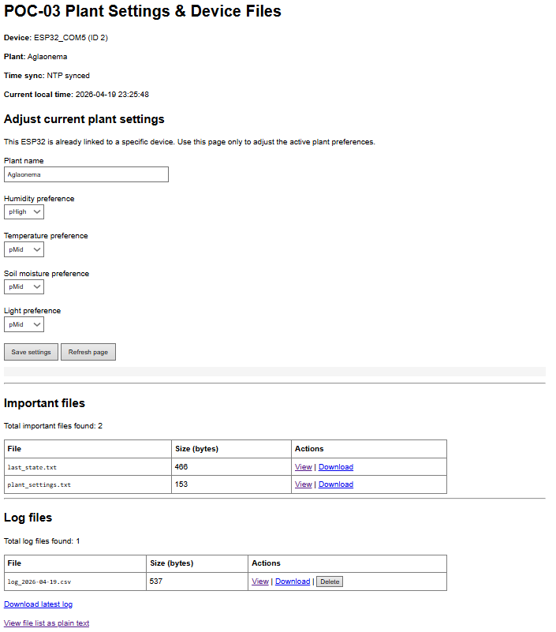
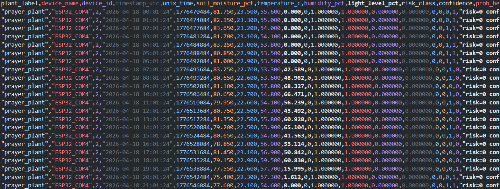

= POC-03: Embedded Plant Monitoring System
:numbered:
:title-page: true
:author: Casey Stijlaart
:docdatetime: datetime (ISO)
:doctype: report
:toc:
:toclevels: 2
:pdf-page-size: A4
:pdf-page-layout: portrait
:xrefstyle: short
:pdf-theme: default
:pdf-fontsize: 11

== Introduction

This third iteration of my proof of concept demonstrates the development and validation of an embedded AI-based plant health monitoring system.

The system is designed to operate on low-cost hardware and provide real-time insights into plant conditions using sensor data and on-device machine learning (TinyML).

The primary goal of this POC is to verify that a trained machine learning model behaves consistently when deployed on an embedded device, compared to offline execution in a Python environment.
Besides that, another goal was to implement further functionality, such as a web interface for user interaction and persistent logging of plant health data.

== Core Changes
Compared to previous iterations, the following core changes were made:

* *Data Logging:*
All collected data and inference results are now stored in CSV format on the ESP32's LittleFS filesystem.
This allows for offline validation and analysis of the system's performance.
* *Web Interface:*
A local web server is hosted on the ESP32, providing a user-friendly interface to view current plant settings, update preferences, and access stored logs.
This enhances user interaction and accessibility of the system.
* *Model Validation:* A comprehensive validation process was conducted to ensure that the TinyML model deployed on the ESP32 produces identical predictions to the original Python implementation when given the same input features.
This confirms the consistency and correctness of the model deployment.
* *Personalization:* Users can now define per-plant preferences for soil moisture, temperature, humidity, and light.
These preferences influence the stress calculations and recommendations, allowing the system to adapt to different plant types without retraining the model.
* *Time Synchronization:* The system now uses NTP to synchronize with real-world time, ensuring accurate timestamps for data logging and user interaction.
The timezone is set to Europe/Amsterdam (CET/CEST), and the system automatically adjusts for daylight saving time.
If NTP synchronization fails, the system falls back to using internal timestamps.

.Core Change : Web Interface via ESP32 Web Server

.Core Change : Data Logging in CSV Format

== System Overview

The system consists of an embedded device (ESP32) equipped with multiple environmental sensors.
These sensors measure key variables that influence plant health:

* Soil moisture
* Ambient temperature
* Relative humidity
* Light intensity

The collected data is processed locally on the ESP32, where a TinyML model performs inference to classify plant health status and generate recommendations.

The system logs all collected data and inference results to a local CSV file stored on the device.This allows for offline validation and analysis.

The following section describes how these components interact during system operation.

== System Operation

The system operates in a continuous loop consisting of four main steps:

. *Data Acquisition:* 
Sensor readings are collected at regular intervals.
  
. *Data Structuring:* 
The raw sensor values are combined into a structured data snapshot, including timestamps and derived features.

. *Model Inference:* 
The TinyML model processes the input data and outputs:

* A predicted risk class (e.g., Healthy, Moderate Stress, High Stress)
* Confidence scores for each class

. *Recommendation Generation:* 
Based on the predicted class, the system generates actionable recommendations, such as:

* Water the plant
* Increase humidity
* Adjust temperature
* Modify light exposure

All outputs are logged for further analysis.

== System Architecture

The system follows a fully local architecture, ensuring independence from external services:

* Data is processed entirely on-device
* No cloud connectivity is required
* Logs are stored locally and can be retrieved via a lightweight HTTP server

This design supports:

* Low-cost deployment
* Offline functionality
* Scalability across multiple devices

The overall system architecture is illustrated in the corresponding diagram.

== Model Validation

To ensure the reliability of the system, a validation process was performed comparing on-device inference with offline Python-based inference.

=== Methodology

The validation consisted of the following steps:

. Data was collected from the ESP32 during runtime and stored as a CSV log file.
. The same dataset was used as input for a Python script running the exported model.
. Predictions from both environments were compared.

=== Results

The results showed that:

* The predicted risk classes were identical across both environments.
* Confidence values matched within floating-point precision.
* No discrepancies were observed in model behavior.

This confirms that the model behaves deterministically across deployment environments, ensuring consistency between development and production.

.Comparison of Predictions
image::/comparison.png[]

=== Validation Scope and Limitations

While the validation confirms consistency between environments, it is important to note its scope:

- The validation used data generated by the deployed system itself.
- External datasets or edge-case scenarios were not included.
- Long-term environmental variability was not explicitly tested.

Therefore, while the results confirm correctness under normal conditions, broader validation may be required for full robustness.

== Future Improvements

* Improve ML model with temporal features
* Add predication for a time window, e.g. "in 1 hour" water or "in 2 hours" increase light.
* Revise best solution for data storage which is lightweight and (in)directly accessible for users, e.g. via web interface or application.
* Optimize power usage for standalone deployment
* Give better suggestion for user actions, such as the soil has been too moist for a long time, so watering is not recommended, or the plant has been in high stress for a long time, so more drastic actions are needed.
* A solution for remote access, e.g. via MQTT or cloud integration, while maintaining security and privacy.
* An approach that allows for multiple plants to be monitored trough a singular interface, e.g. a mobile app or web dashboard, while keeping the system scalable and user-friendly.

== Conclusion

This proof of concept successfully demonstrates a fully embedded AI-based plant health monitoring system using TinyML.

The validation confirms that the deployed model produces consistent and reliable predictions when compared to offline execution.
This ensures that the system can be trusted to operate independently in real-world conditions.

The results align with the original goal of creating an accessible, low-cost, intelligent plant monitoring solution for hobbyist users, while providing a strong foundation for further development and refinement.