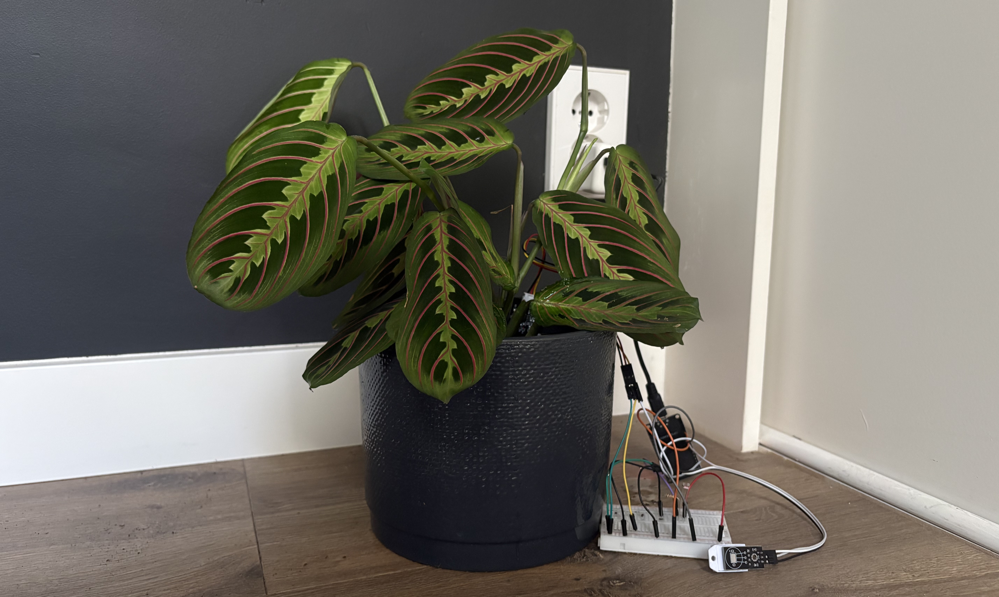

= PP Psychological Impact Assessment : Minor AI for Society
:title-page: true
:author: Casey Stijlaart
:docdatetime: datetime (ISO)
:doctype: report
:toc:
:toclevels: 3
:pdf-page-size: A4
:pdf-page-layout: portrait

<<<

== Introduction
This document explores the psychological aspects of the potential impact of the Smart Desk Plant Monitoring system on users. 
It delves into how the system could influence users' emotions, behaviors, and overall well-being, as well as the potential psychological benefits and challenges that may arise from its use.

== Context
The Smart Desk Plant Monitoring system is designed to provide users with real-time feedback and suggestions for caring for their plants, using sensors and AI predictions to monitor plant health and environmental conditions.
The system aims to enhance users' experience with plant care, making it more accessible and engaging, while also promoting a deeper connection and understanding of their plants and environment.

<<<

== Intended Psychological Benefits
The Smart Desk Plant Monitoring system is designed to foster a sense of connection and care for plants, which can have positive psychological effects on users.

The aim is to reduce stress and promote relaxation by providing users with a simple and intuitive way to care for their plants, which can contribute to improved mental well-being.
By providing feedback on plant health and predictions, the system can also enhance users' sense of competence and autonomy in caring for their plants, which can boost self-esteem and motivation.
Additionally, the system can encourage mindfulness and presence by prompting users to engage with their plants and environment, which can lead to increased awareness and appreciation of nature.
Finally, the system may improve the accessibility of plant care, making it easier for people with limited gardening experience to enjoy the benefits of having plants.

== Potential Psychological Challenges
While the Smart Desk Plant Monitoring system has the potential to provide psychological benefits, there are also potential challenges that need to be considered.
One potential challenge is that users may become overly reliant on the system for plant care, which could reduce their critical engagement with their surroundings and weaken their environmental knowledge and practical skills.
Another challenge is that users may feel stressed or pressured to follow the AI's recommendations, which could lead to negative emotions and a decrease in motivation if they feel they are not meeting the system's expectations.
Additionally, there is a risk that users may become frustrated or discouraged if the system provides inaccurate feedback or if their plants do not thrive despite following the system's advice, which could lead to feelings of failure and decreased self-esteem.

== User Autonomy & Decision-Making
The focus should be on maintaining a balance between providing helpful feedback and allowing users to make their own decisions about plant care.

This could be done in various ways, such as emphasizing the educational aspect of the system, providing users with autonomy in decision-making, and avoiding gamification elements that may pressure users to comply with the system's recommendations.
Ensuring that the user understands that the system makes suggestions rather than dictating commands. This can help users feel more in control and less pressured, which can enhance their overall experience and satisfaction with the system.

Another important aspect is transparency about how the AI makes its suggestions, which can help build trust and understanding between the user and the system.
An example would be, if the system provides a recommendation to water the plant, it could also explain that this suggestion is based on the current moisture levels and the plant's specific needs, which can help users understand the reasoning behind the advice and make informed decisions about their plant care.

== Trust, Transparency, and AI Suggestions
From the beginning of the project, it was clear that the system should be designed to provide helpful feedback and suggestions to users, but ultimately allow them to make their own decisions about plant care.
This approach was intended to empower users and encourage them to engage with their plants and environment in a meaningful way, rather than relying solely on the system's recommendations.

This could be achieved by always being transparent about how and why the system makes the given suggestion. 
Another aspect of transparency is explaining that sensor readings and AI predictions are not always perfect, and that users should consider multiple factors when making decisions about their plant care.

== Mitigation Strategies
To mitigate and reduce the psychological risks associated with the system, it is important to design the system in a way that promotes user autonomy and critical engagement.

There are various ways this could be done, such as ensuring to use non-alarming language in the system's feedback, providing users with options and explanations for the suggestions, and encouraging users to learn about their plants and environment through the system's educational features.
Additionally, it should be encouraged to not solely rely on the system's recommendations, but to also use their own judgment and knowledge when caring for their plants.
This can help users feel more in control and less pressured, which can enhance their overall experience and satisfaction with the system, while also promoting a deeper connection and understanding of their plants and environment.

== Long-Term User Interaction Effects
As users interact with the Smart Desk Plant Monitoring system over time, it is important to consider the long-term psychological effects that may arise from this interaction.

One potential effect is that users may develop a stronger connection and sense of responsibility towards their plants, which can lead to increased environmental awareness and a greater appreciation for nature.
However, there is also a risk that users may become overly dependent on the system for plant care, which could reduce their critical engagement with their surroundings and weaken their environmental knowledge and observational skills.
Another aspect to consider is that the users' relationship with the system may evolve over time, as they become more familiar with its features and capabilities, which could lead to changes in their emotional responses and behaviors towards their plants and the environment.
It is important to design the system in a way that promotes a healthy and balanced relationship between users and their plants, while also encouraging users to engage with their environment in a meaningful way, rather than relying solely on the system's recommendations.

== Conclusion
The Smart Desk Plant Monitoring system has the potential to provide various psychological benefits to users, such as reducing stress, promoting relaxation, enhancing a sense of competence and autonomy, encouraging mindfulness, and improving accessibility to plant care.
However, there are also potential psychological challenges that need to be considered, such as over-reliance on the system, stress from feeling pressured to follow recommendations, and frustration from inaccurate feedback or plant care outcomes.
To mitigate these risks, it is important to design the system in a way that promotes user autonomy, critical engagement, and transparency about how the AI makes its suggestions.
By doing so, the system can foster a positive and meaningful relationship between users and their plants, while also encouraging users to engage with their environment in a way that promotes environmental awareness and a deeper connection to nature.
