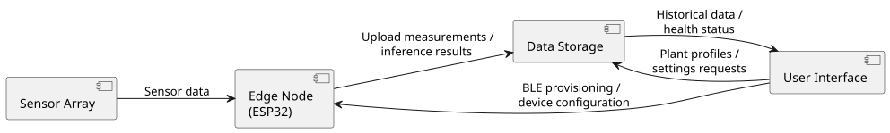

= Components

The system is composed of several components that work together to monitor plant health and provide feedback to the user.
To outline each component and their role, an overview is given, see <<Description>>.
Next to that, a component diagram, <<Diagram>> is given to illustrate the relationships between the components.

[[Description]]
.Component Description
[%autowidth]
|===
| Component | Description

| Edge Node (EN) | The Edge Node is the ESP32 firmware. It reads the sensor array, performs feature engineering and local ML inference, generates care recommendations, and keeps a local history on flash storage (LittleFS).
It uploads measurements and model metrics to the data storage, polls it for user commands, and is configured through BLE provisioning.
| Sensor Array (SA)| The sensor array consists of the sensors that monitor the plant's environment: a capacitive soil moisture sensor, a DHT22 temperature/humidity sensor, and an LDR light sensor. These sensors provide real-time data to the Edge Node.
| User Interface (UI) | The user interface is a mobile app that allows the user to manage plant profiles, view plant health status and historical data, and configure devices.
It communicates with the data storage for data access and uses BLE to provision nearby Edge Nodes.
| Data Storage (DS) | A Supabase backend that stores device registrations (`devices` table), plant profiles and settings (`plant_settings`), sensor readings (`plant_readings`), model metrics (`model_metrics`), and device logs (`logs`). Acts as the central source of truth for the system and enables remote access to plant data.

|===

[[Diagram]]
.Component Diagram

<<<

== Messages Between Components
To showcase how each component is connected to another, the main messages that connect them are listed, see <<Messages between components>>.
The message names correspond to the methods in the implemented software; supporting calls (heartbeats, logging, device deletion) are omitted here and can be found in the sequence diagrams and the API reference.

.Messages between components
|===
| Message name | From | To | Description

| `ReadPercent()`, `Read()`, `ReadLightLevelPct()` | Edge Node | Sensor Array | Reads the soil moisture, temperature/humidity, and light level.

| `RegisterDevice(deviceId, deviceName)` | Edge Node | Data Storage | Registers the device after successful provisioning.

| `SendReading(json)` / `SendModelMetrics(json)` | Edge Node | Data Storage | Uploads a monitoring cycle result and its model metrics.

| `FetchProfileSettings(plantLabel)` | Edge Node | Data Storage | Retrieves the assigned plant profile (thresholds and preferences).

| `CheckTriggerMeasurement()` / `CheckTriggerReset()` | Edge Node | Data Storage | Polls the user command flags every 5 seconds.

| insert/update `plant_settings` | Interface | Data Storage | Stores a new or updated plant profile.

| query `plant_readings` | Interface | Data Storage | Requests current and historical plant data for visualization.

| set `trigger_measurement` / `trigger_reset` | Interface | Data Storage | Requests an on-demand measurement or removal of a device.

| BLE provisioning (write credentials) | Interface | Edge Node | Discovers an unpaired Edge Node and sends WiFi credentials and cloud configuration during setup.

|===
