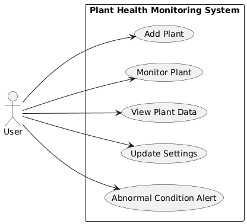

= Use Cases

This section describes the main interactions between the user and the system. 
The use cases focus on plant monitoring, configuration, and data visualization.

[.figure]
.Use Case Diagram

<<Use Case Diagram>> depicts some of the use cases.
It shows system boundary and specifies how actors interact with the system.
Each use case will be described in the following table.

[.table]
.Use Case 01
|===
| ID: UC01 | Use Case Name: Add Plant

| Description | The user adds a new plant by providing plant details such as name, type, and care requirements. The system stores this information for monitoring.
| Actor(s) | User
|===

[.table]
.Use Case 02
|===
| ID: UC02 | Use Case Name: Monitor Plant

| Description | The system monitors plant conditions using sensor data and ML inference, and makes the results available to the user.
| Actor(s) | User
|===

[.table]
.Use Case 03
|===
| ID: UC03 | Use Case Name: View Plant Data

| Description | The user views current and historical plant data through the system interface.
| Actor(s) | User
|===

[.table]
.Use Case 04
|===
| ID: UC04 | Use Case Name: Update Settings

| Description | The user updates plant care settings such as soil moisture thresholds. The system stores and applies the updated configuration.
| Actor(s) | User
|===

[.table]
.Use Case 05
|===
| ID: UC05 | Use Case Name: Abnormal Condition Alert

| Description | The system detects abnormal plant conditions and notifies the user with relevant information and suggested actions.
| Actor(s) | User
|===
