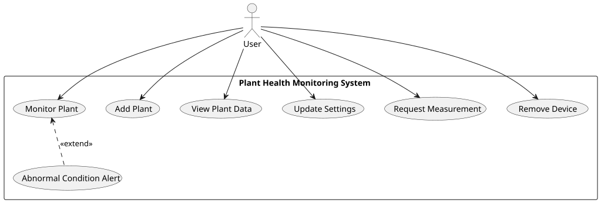

= Use Cases

This section describes the main interactions between the user and the system.
The use cases cover device pairing, plant monitoring, configuration, data visualization, and device removal, as realized in the implemented system.

[.figure]
.Use Case Diagram

<<Use Case Diagram>> depicts the use cases.
It shows the system boundary and specifies how the actor interacts with the system.
Each use case is described in the following tables.

[.table]
.Use Case 01
|===
| ID: UC01 | Use Case Name: Add Plant

| Description | The user adds a new plant by pairing a device over BLE through the app, then saves the plant name and care preferences, which the device picks up to start monitoring.
| Actor(s) | User
|===

[.table]
.Use Case 02
|===
| ID: UC02 | Use Case Name: Monitor Plant

| Description | The system monitors plant conditions on a fixed schedule using sensor data and on-device ML inference, and makes the results available to the user.
| Actor(s) | User
|===

[.table]
.Use Case 03
|===
| ID: UC03 | Use Case Name: View Plant Data

| Description | The user views current and historical plant data, health status, and care recommendations through the app.
| Actor(s) | User
|===

[.table]
.Use Case 04
|===
| ID: UC04 | Use Case Name: Update Settings

| Description | The user updates plant care settings such as moisture, temperature, humidity, and light preferences. The device applies the updated profile before each scheduled cycle.
| Actor(s) | User
|===

[.table]
.Use Case 05
|===
| ID: UC05 | Use Case Name: Abnormal Condition Alert

| Description | The system detects abnormal plant conditions during monitoring and notifies the user with the stress level and suggested actions.
| Actor(s) | User
|===

[.table]
.Use Case 06
|===
| ID: UC06 | Use Case Name: Request Measurement

| Description | The user requests an immediate measurement from the app, which the device answers with a full monitoring cycle.
| Actor(s) | User
|===

[.table]
.Use Case 07
|===
| ID: UC07 | Use Case Name: Remove Device

| Description | The user removes a device from the app. The device performs a factory reset, erasing all local and cloud state, and reboots into pairing mode.
| Actor(s) | User
|===
