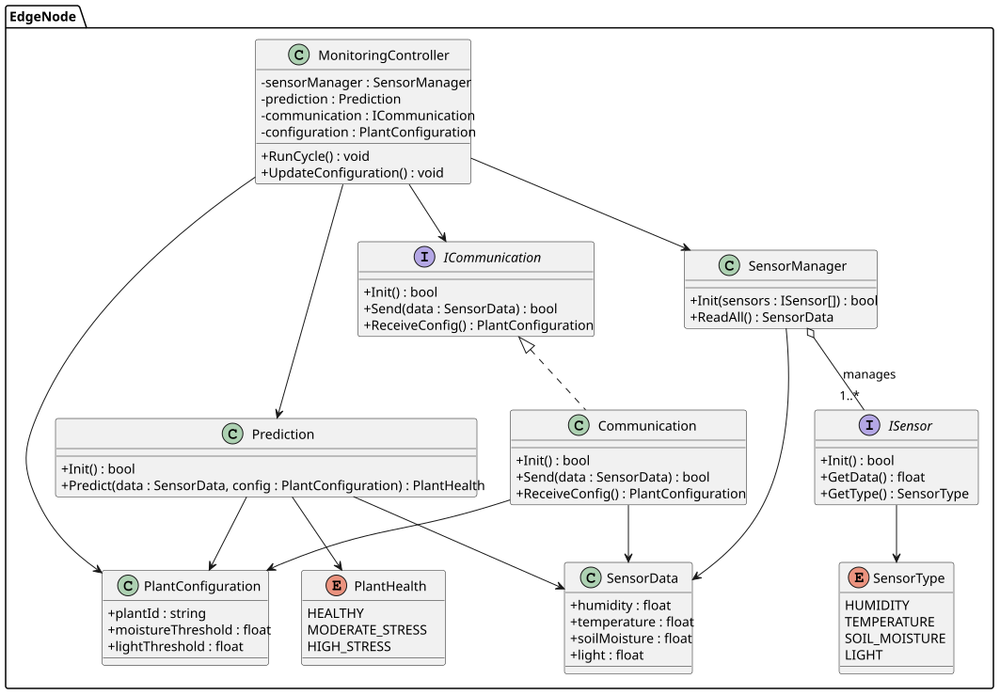

= Class Diagram : ESP Firmware

The class diagram for the ESP firmware is designed to illustrate the structure and relationships between the various classes that make up the firmware. 
The diagram includes classes for handling sensor data, communication protocols, and device management.

.Class Diagram

