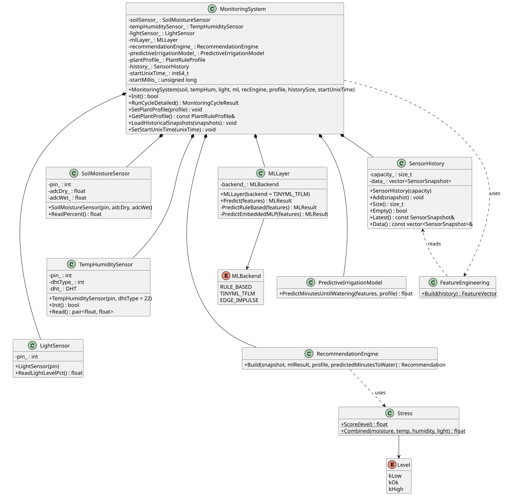
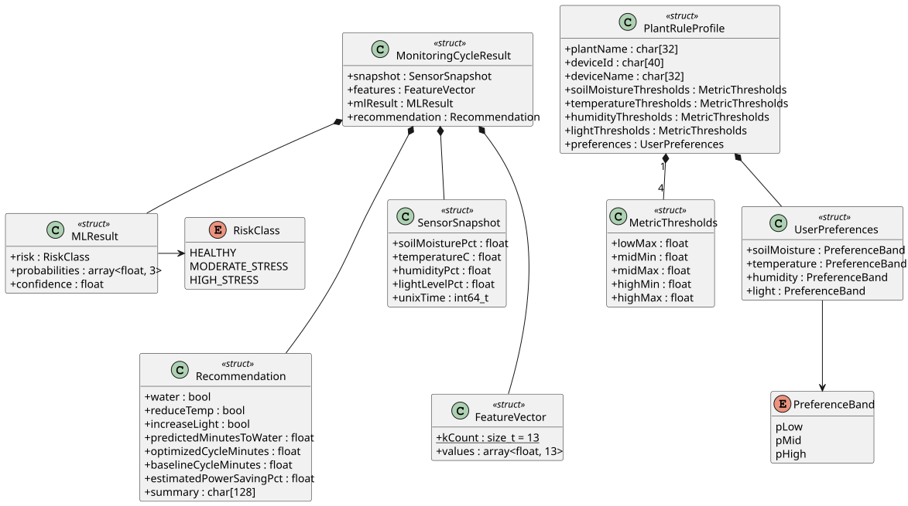
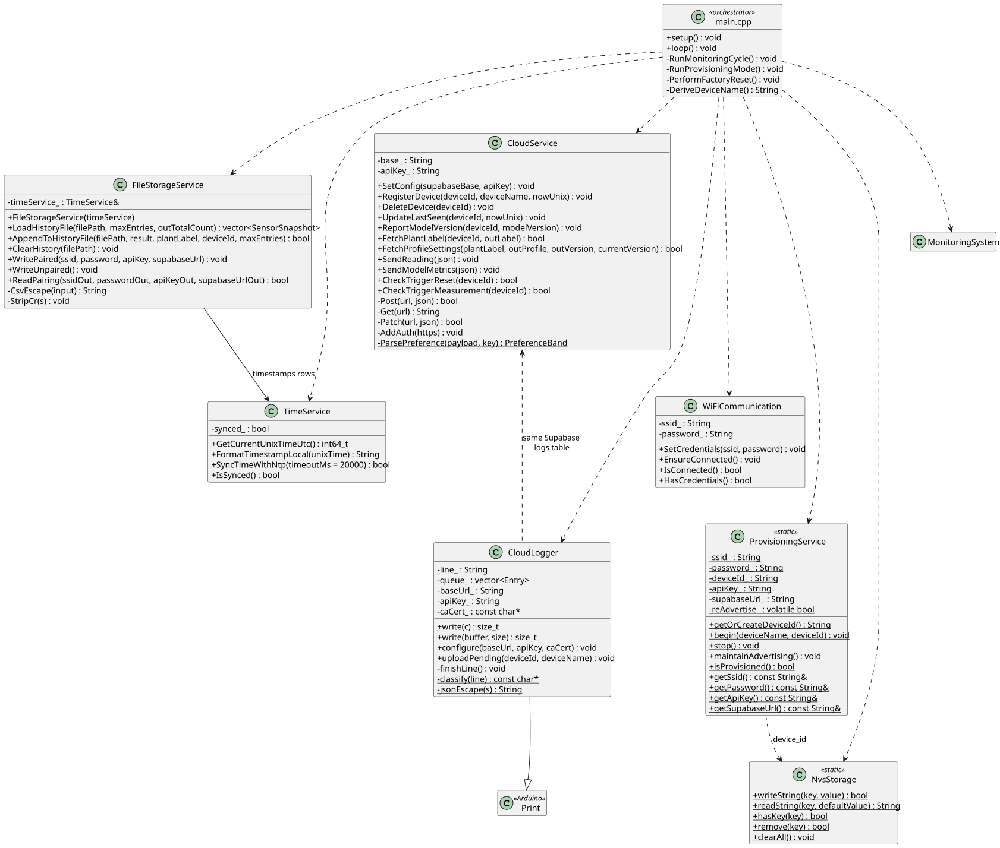

= Class Diagrams : ESP Firmware

The class diagrams below illustrate the structure and relationships between the classes that make up the ESP32 firmware (v1.1.0).
They are generated from the source and header files in `firmware/src` and `firmware/include`, and are split into three logical groups: the monitoring pipeline, the shared data types, and the connectivity, storage, and service classes.

== Monitoring pipeline

The `MonitoringSystem` class orchestrates a full measurement cycle: it reads the soil moisture, temperature/humidity, and light sensors, stores the snapshot in a ring buffer (`SensorHistory`), builds a 13-value feature vector (`FeatureEngineering`), runs the ML inference (`MLLayer`) and the predictive irrigation model, and finally asks the `RecommendationEngine` to translate the results into user-facing actions.

.Class Diagram — monitoring pipeline (sensors → ML → recommendation)

<<<

== Shared data types

All components exchange data through a small set of plain structs defined in `PlantTypes.hpp`.
A `MonitoringCycleResult` bundles the raw snapshot, the feature vector, the ML result, and the recommendation produced in one cycle.
The `PlantRuleProfile` holds the per-plant thresholds and user preferences fetched from the cloud.

.Class Diagram — shared data types (PlantTypes.hpp)

<<<
    
== Connectivity, storage & services

The service layer connects the device to the outside world: `WiFiCommunication` manages the network link, `CloudService` talks to the Supabase REST API, `ProvisioningService` handles BLE pairing on first boot, and `FileStorageService`/`NvsStorage` persist history and pairing state locally.
`CloudLogger` mirrors serial log output to the cloud, and `main.cpp` orchestrates all of them.

.Class Diagram — connectivity, storage & services

