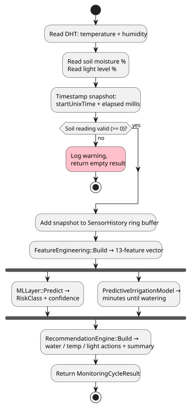

= Flow Charts : ESP Firmware

The flow charts below describe the control flow of the firmware: the boot sequence, the main loop, and the internals of a single monitoring cycle.
The longer flows are split into parts that are shown next to each other.

== Boot flow

On boot the firmware decides between provisioning mode (no pairing document on flash) and normal operation (part 1).
Once connected, it fetches the plant label and profile from the cloud, restores the sensor history, and runs the first monitoring cycle (part 2).
A missing plant assignment outside the provisioning grace period triggers a factory reset.

.Flow Chart — boot / `setup()` flow (part 1: provisioning + connectivity, part 2: plant profile + first cycle)
[cols="a,a", frame=none, grid=none]
|===
| image::../images/flow-boot-1.svg[pdfwidth=50%]
| image::../images/flow-boot-2.svg[pdfwidth=50%]
|===

<<<

== Main loop

The main loop runs two timers: a 5-second tick that polls the cloud for commands (`trigger_reset`, `trigger_measurement`) and watches for a plant being assigned, and a 3-hour tick that refreshes the plant profile and runs a scheduled monitoring cycle.

.Flow Chart — main `loop()` flow (left: 5-second command tick, right: 3-hour scheduled tick)
[cols="a,a", frame=none, grid=none]
|===
| image::../images/flow-loop-5s.svg[pdfwidth=85%]
| image::../images/flow-loop-3h.svg[pdfwidth=70%]
|===

<<<

== Monitoring cycle internals

A single cycle reads all sensors, validates the soil reading, appends the snapshot to the history buffer, builds the feature vector, runs the ML prediction and irrigation prediction in parallel, and produces the final recommendation.

.Flow Chart — monitoring cycle (`MonitoringSystem::RunCycleDetailed`)

<<<

== Pairing states and timing constants

The behavior in the flow charts is driven by the pairing state stored on flash (`/pairing_state.txt`) and a small set of timing constants.
WiFi credentials are only persisted in the pairing document; marking the device unpaired erases them by construction, so an unpaired device retains no WiFi secrets.

.Pairing states
|===
| State | Behaviour

| File missing | Created as `unpaired` on first read → BLE provisioning mode
| `unpaired` | BLE provisioning mode — wait for app
| `paired` + plant settings exist | Normal operation
| `paired` + no plant settings (boot) | Immediate reset → BLE provisioning mode
| `paired` + no plant settings (running) | Grace period → reset → BLE provisioning mode
|===

.Key firmware constants
|===
| Constant | Value | Purpose

| `kIntervalMs` | 3 hours | Regular monitoring cycle interval
| `kCommandCheckMs` | 5 seconds | Command flag poll interval
| `kHistorySize` | 56 entries | Local sensor history ring buffer
| `kMaxNoPlantTicks` | 30 ticks (2.5 min) | Grace period before reset when no plant is assigned
|===
