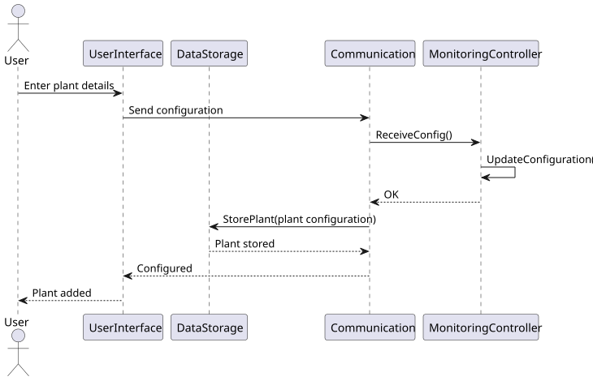
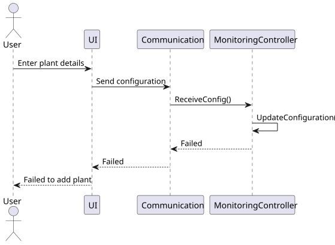
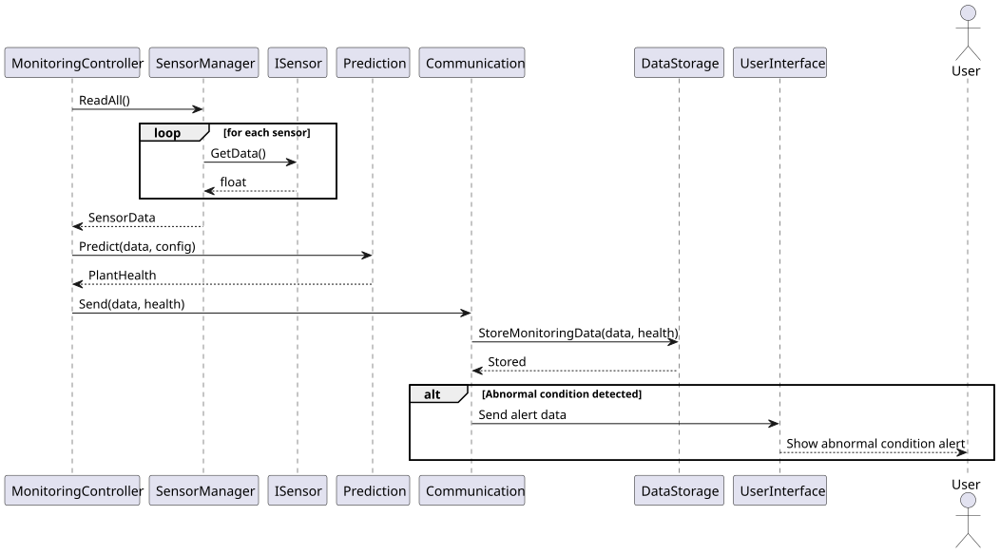
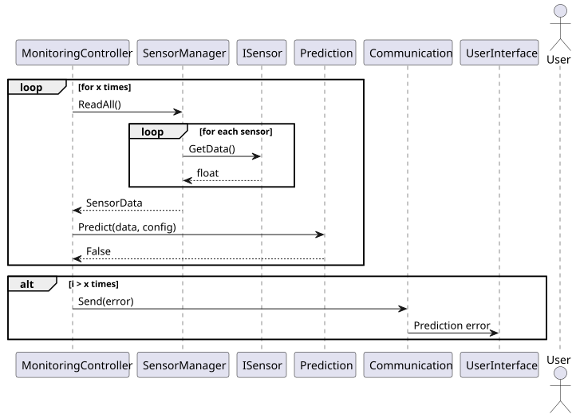
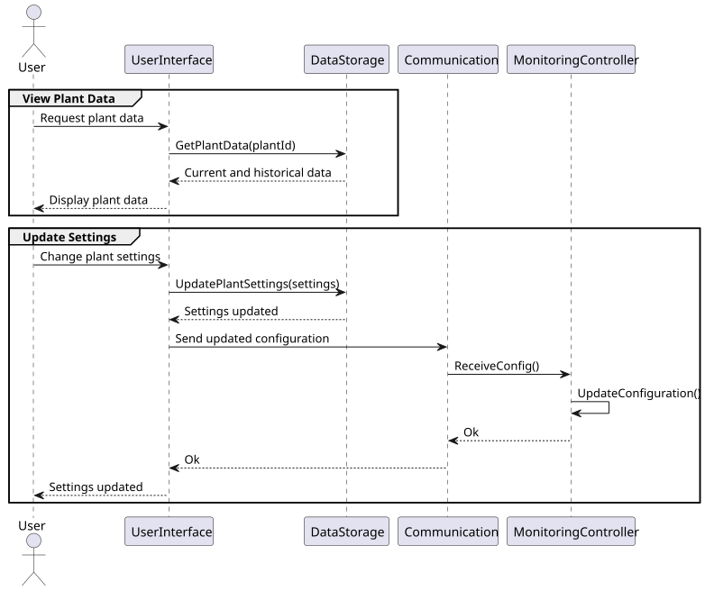

= Sequence Diagrams

Per use case, there is an associated sequence diagram that describes the interactions between the system components to achieve the desired functionality. 
These diagrams provide a visual representation of the flow of messages and the order of operations within the system.

== UC01 : Add Plant

*Scenario*: A user is able to add a new plant to the system by entering its details through the user interface.

.UC01 Sequence Diagram

*Scenario*: If there is an error during the plant addition process, the system should handle it gracefully and inform the user.

.UC01 Error Handling Sequence Diagram

== UC02 + UC05 : Monitor Plant + Abnormal Condition Alert

*Scenario*: The system continuously monitors the plant's conditions and sends alerts to the user if any abnormal conditions are detected.

.UC02 + UC05 Sequence Diagram

<<<
    
*Scenario* : The system is not able to read sensor data or predict plant health, and it should handle these errors appropriately.

.UC02 + UC05 Error Handling Sequence Diagram

<<<

== UC03 + UC04 : View Plant Data + Update Settings

.UC03 + UC04 Sequence Diagram

