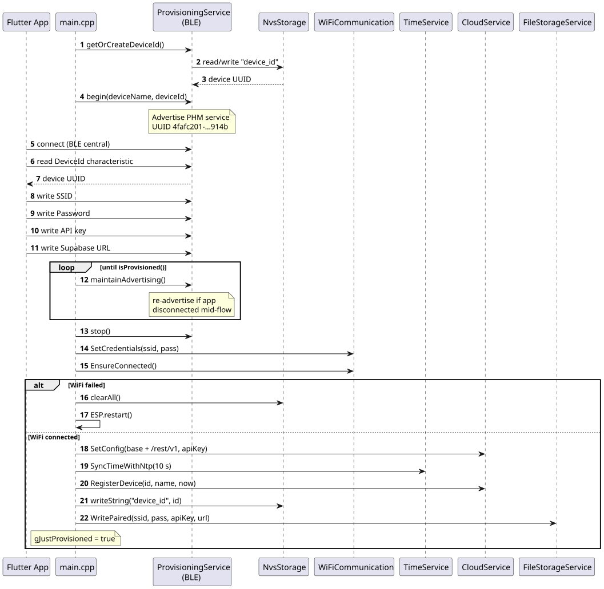
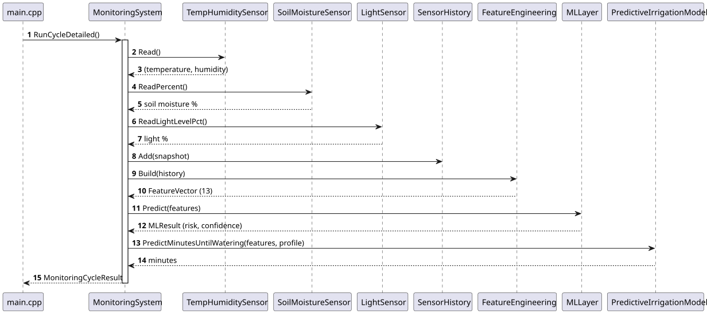
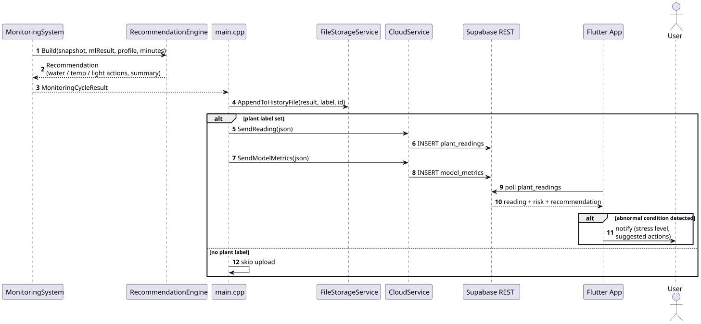
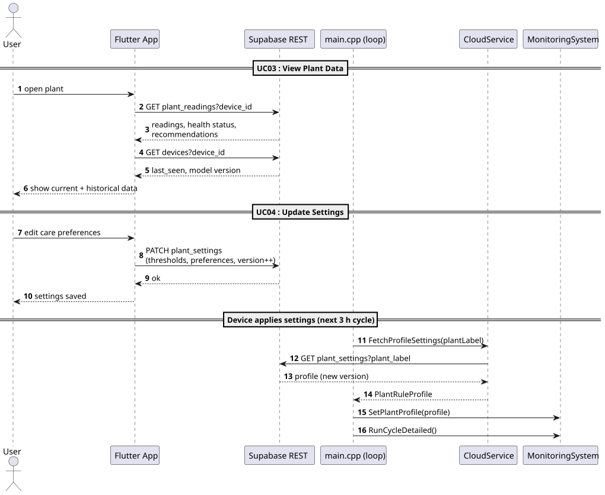
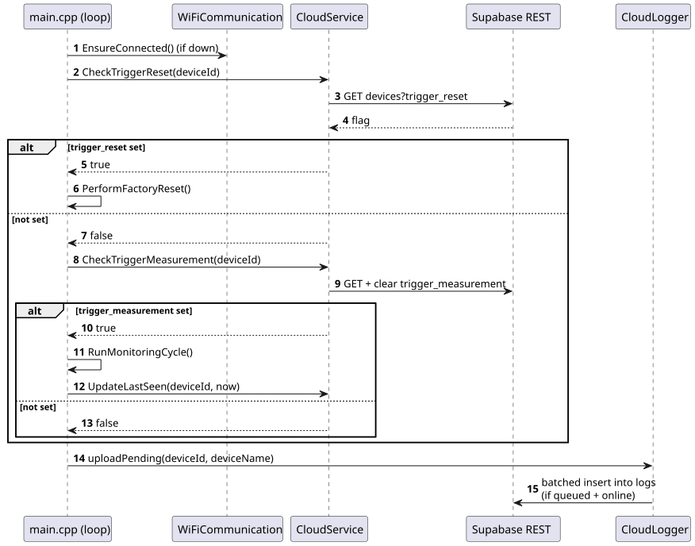
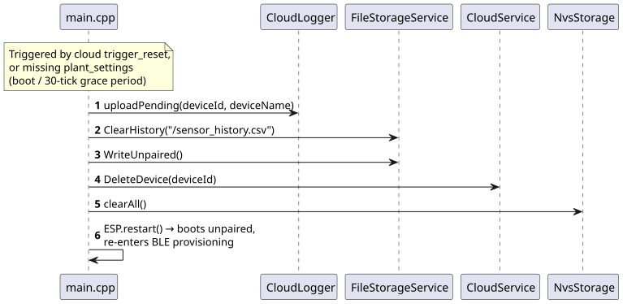

= Sequence Diagrams

Per use case, there is an associated sequence diagram that describes the interactions between the system components to achieve the desired functionality.
The diagrams are generated from the firmware source code (v1.1.0) and show the realized interactions between the app, the firmware classes, and the cloud backend.

<<<

== UC01 : Add Plant

*Scenario*: A user adds a new plant by pairing a device through the app.
On first boot (unpaired) the device advertises a BLE service (`PHM-XXXXXX`) that the app uses to transfer the WiFi credentials, API key, and cloud URL.
After a successful WiFi connection the device registers itself in the `devices` table and writes the pairing document to flash; the app then detects the new device, lets the user save the plant name and preferences, and the device picks up the plant assignment through its 5-second polling (see UC06).
If the WiFi connection fails, the device wipes its state and restarts so the user can retry.

.UC01 Sequence Diagram — BLE provisioning and device registration

<<<

== UC02 : Monitor Plant

*Scenario*: The system monitors the plant's conditions on a schedule (every 3 hours).
Each cycle reads all sensors, stores the snapshot in the history buffer, builds the feature vector, and runs the ML inference and irrigation prediction.

.UC02 Sequence Diagram — monitoring cycle

<<<

== UC05 : Abnormal Condition Alert

*Scenario*: At the end of each monitoring cycle, the recommendation engine translates the prediction into care actions.
The result is appended to the local history file; if a plant is assigned, the reading and model metrics are also uploaded to the cloud, where the app picks them up and notifies the user of abnormal conditions and suggested actions.

.UC05 Sequence Diagram — recommendation, cloud upload + alert

<<<

== UC03 + UC04 : View Plant Data + Update Settings

*Scenario*: The user views plant data and changes settings through the app, which reads from and writes to the data storage directly (`plant_readings`, `plant_settings`).
No interaction with the device is required to view data; the device applies updated settings by re-fetching its plant profile (`FetchProfileSettings`) before every scheduled monitoring cycle.

.UC03 + UC04 Sequence Diagram — view plant data + update settings

<<<
    
== UC06 : Request Measurement

*Scenario*: The user requests an immediate measurement from the app, which sets the `trigger_measurement` flag on the device's row.
Every 5 seconds the device polls the command flags, answers a set measurement flag with a full monitoring cycle, and flushes any queued log lines.

.UC06 Sequence Diagram — cloud command polling (every 5 s)

<<<

== UC07 : Remove Device

*Scenario*: The user removes a device from the app, which sets the `trigger_reset` flag (the same reset also runs when a plant assignment is missing beyond the grace period).
The device uploads pending logs, clears its local history and pairing state (erasing the WiFi credentials), deletes its registration from the `devices` table, wipes its non-volatile storage, and restarts into BLE provisioning mode so it can be paired again.

.UC07 Sequence Diagram — factory reset

